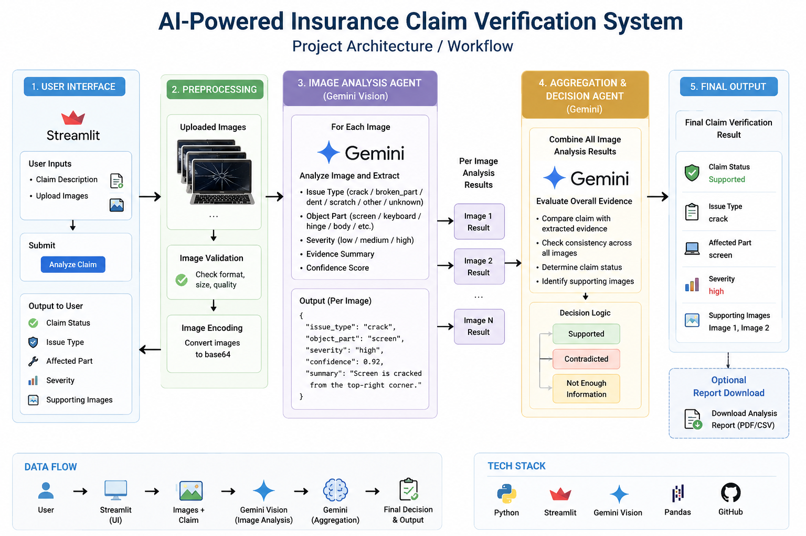
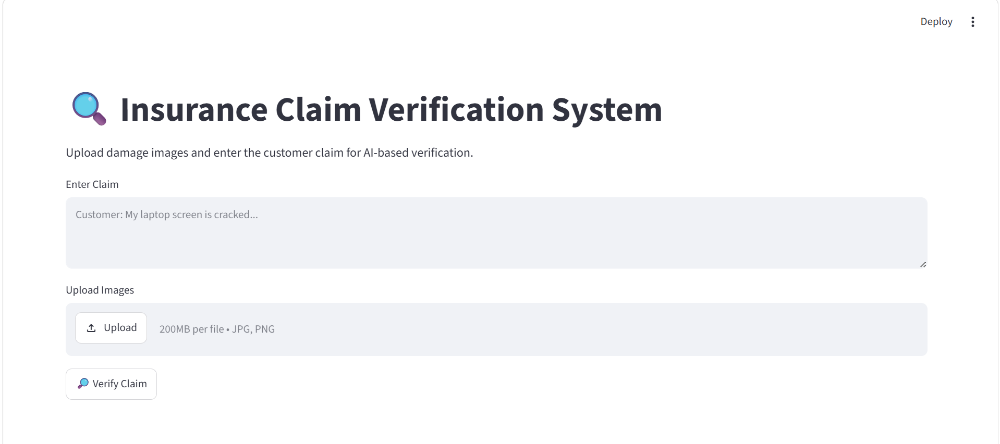
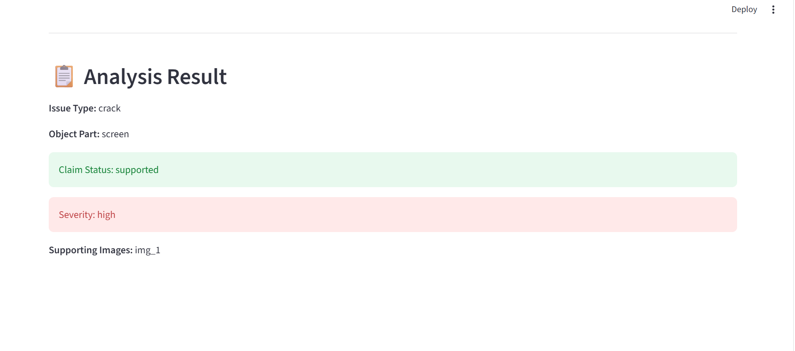

# Insurance Claim Verification System

An AI-powered insurance claim verification system that analyzes uploaded images and customer claim conversations to determine whether a claim is supported, contradicted, or lacks sufficient evidence.

## Features

- Image-based damage verification
- Gemini AI powered image analysis
- Multi-image evidence aggregation
- Severity assessment
- Support for:
  - Cars
  - Laptops
  - Packages
- Streamlit dashboard interface

## Tech Stack

- Python
- Google Gemini API
- Streamlit
- Pandas
- Pillow

## Project Structure

agents/
data/
images/
streamlit_app/
main.py

## Run Locally

pip install -r requirements.txt

streamlit run streamlit_app/app.py

## Example Output

Issue Type: crack
Object Part: screen
Claim Status: supported
Severity: high

## Screenshots

### Architecture

### Streamlit Dashboard

### Result
